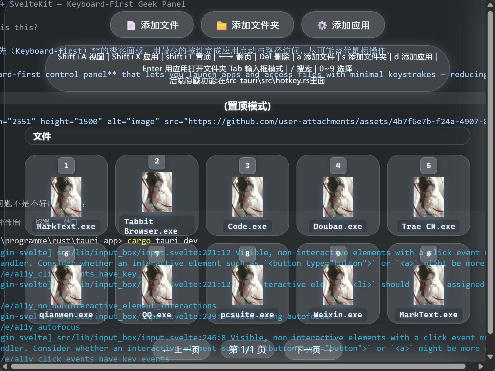
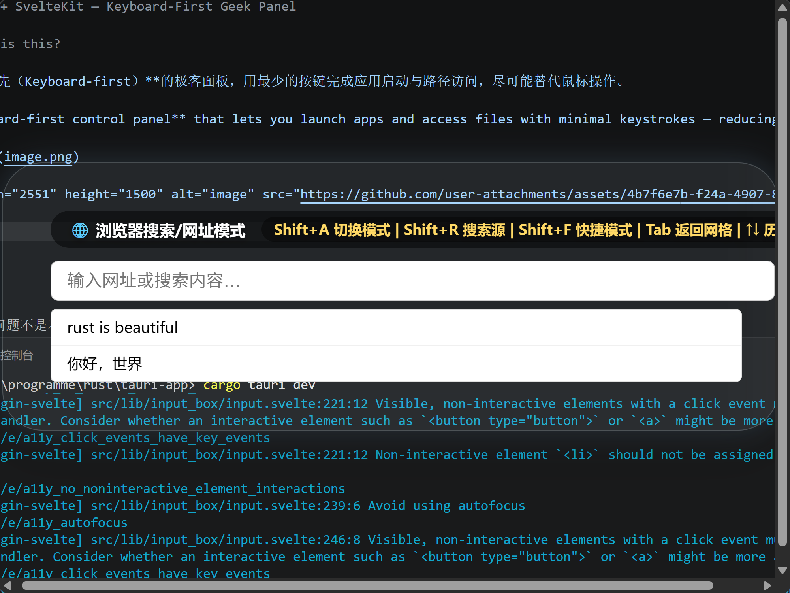

---

# 🚀 Tauri + SvelteKit — Keyboard-First Geek Panel

## 💡 What is this?

一个**键盘优先（Keyboard-first）**的极客面板，用最少的按键完成应用启动与路径访问，尽可能替代鼠标操作。

> A **keyboard-first control panel** that lets you launch apps and access files with minimal keystrokes — reducing or eliminating mouse usage.



> 


---

## ⚡ Why?

现代 GUI 的问题不是不好用，而是：

👉 **步骤太多了**

一个简单操作：

```
移动鼠标 → 找位置 → 点击 → 再找 → 再点
```

重复 100 次之后，这件事就变得很荒谬。

> GUIs are not bad — they’re just **too step-heavy** for repetitive tasks.

如果你用过命令行，你应该知道有更快的方式。

> If you've used the command line, you already know there’s a faster way.

---

## 🧠 Philosophy

* 极简（Minimal）
* 快速（Fast）
* 可预判（Predictable）
* 零路径依赖（No navigation overhead）

> - Minimal
> - Fast
> - Predictable
> - Zero navigation overhead

灵感来自 Linux：

> “Everything is a file” → **Everything should be instantly reachable**

---

## 🔥 What makes it different?

### ❌ 传统方式（以 Visual Studio Code 为例）

```
Ctrl + O → Ctrl + K → 鼠标滚动 → 点击
```

### ✅ 本项目

```
最多 4 次按键 → 直接打开
```

> ≤ 4 keystrokes to open anything — no matter how deep it is.

---

## ⚙️ Core Features

* ⚡ 快速启动任意应用（App launcher）
* 📂 深层路径瞬间访问（Deep path access）
* 🔑 自定义快捷入口（Custom shortcuts）
* 🧩 基于配置驱动（Config-driven）
* 🖥 跨平台（thanks to Tauri）

---

## 🚀 Quick Start

```bash
# 1. 克隆项目
git clone https://github.com/xubosia/cli-jikon.git

# 2. 进入项目
cd cli-jikon

# 3. 安装依赖
pnpm install

# 4. 启动开发环境
pnpm tauri dev
```

> Requires:
>
> * Node.js
> * Rust
> * Tauri environment

---

## 🧩 Recommended Setup

* Visual Studio Code
* Svelte extension
* Tauri extension
* rust-analyzer

---

## 🎯 Use Cases

适合这些人：

* 🧑‍💻 开发者（频繁切项目）
* 🎨 设计师（PS / AE / Blender 重度用户）
* ⚙️ 重度键盘党（Keyboard power users）
* 🧠 讨厌重复操作的人

> For:
>
> * Developers
> * Designers
> * Keyboard power users
> * Anyone tired of repetitive workflows

---

## 📺 Demo

抖音账号：**yekongzhiton**

> Demo videos will be posted here.

---

## 🧪 Current Status

⚠️ 仍在开发中（Work in Progress）

有些设计我还没有完全想清楚，欢迎任何建议 / PR。

> Still evolving — feedback and contributions are welcome.

---

## 🤝 Contributing

欢迎：

* 提 issue
* 提 PR
* 提想法（哪怕很激进）

> PRs, ideas, and critiques are all welcome.

---

## 💬 One More Thing

这不是一个“更好用的启动器”。

这是一个尝试：

👉 **重新思考“我们为什么还在用鼠标做这些事？”**

> This is not just a launcher.
> It’s an attempt to rethink:
> **Why are we still doing this with a mouse?**

---